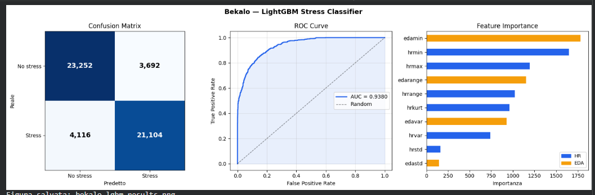
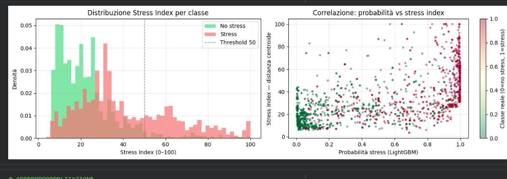
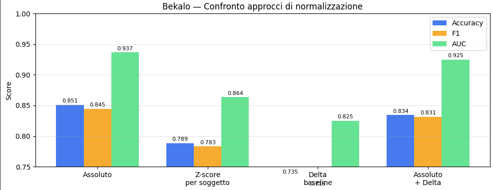

# Data

Data are taken from SynthesizedStressData.csv from https://github.com/xalentis/Stress

They are originated form Ensemble Machine Learning Model Trained on a New Synthesized Dataset Generalizes Well for Stress Prediction Using Wearable Devices Gideon Vos, Kelly Trinh, Zoltan Sarnyai, Mostafa Rahimi Azghadi doi = https://doi.org/10.1016/j.jbi.2023.104556

Info on the database :
Shape: (256800, 12)
Soggetti: 200

Class distributio :
metric
No stress (0)    132069
Stress (1)       124731

ex. of data

Name: count, dtype: int64
hrrange	hrvar	hrstd	hrmin	edarange	edastd	edavar	hrkurt	edamin	hrmax	Subject	metric
0	0.51	0.022021	0.148395	94.92	0.008442	0.002034	0.000004	-0.214136	0.330539	95.43	X1	0
1	0.51	0.022021	0.148395	94.92	0.008442	0.002034	0.000004	-0.214136	0.330539	95.43	X1	0
2	0.51	0.022021	0.148395	94.92	0.008442	0.002034	0.000004	-0.214136	0.330539	95.43	X1	0

For training i use LightGBM

  Accuracy  : 0.8503  (85.0%)
  Precision : 0.8511 
  Recall    : 0.8368  
  F1 Score  : 0.8439  
  AUC-ROC   : 0.9380  

# 0/1 Classification

Classification report:

              precision    recall  f1-score   support

   No stress       0.85      0.86      0.86     26944
      Stress       0.85      0.84      0.84     25220

    accuracy                           0.85     52164
   macro avg       0.85      0.85      0.85     52164
weighted avg       0.85      0.85      0.85     52164

Cross-validation 5-fold (subject-level)
  Fold 1: 0.8627
  Fold 2: 0.8515
  Fold 3: 0.8566
  Fold 4: 0.8576
  Fold 5: 0.8592

CV accuracy: 0.8576 ± 0.0037

Interesting to note that EADMIN is the most important feature of all, followed by hrmin and hrmax. This is counterintuitive compared to the synthetic dataset where edastd and edavar dominated.
What it means: the model learns primarily from the minimum absolute values ​​of EDA and HR, not from their variability. Low edamin → underactive sweat glands at baseline → no stress. High edamin → elevated sympathetic tone even in the "calm" moments of the window → stress.
edastd and hrstd are the least important—intra-window variability matters little compared to the absolute level. We need to have the baseline value before measuring

The confusion matrix is fairly symmetric—the model does not have a strong bias toward one class. The 4,116 missed stress samples are the most critical number for Bekalo: these are athletes under stress that the system does not detect.

# Extraction of a continue value from a 0/1 lassification

Beyond binary classification, a continuous stress index is derived from each sample's Euclidean distance to the no-stress centroid in normalized feature space — the further a sample sits from the average resting physiology, the higher the score.

# Normalization comparison

I tried different way of normalizing data because different person have different resting rate, so i tought a delta would be more accurate. Spoiler: noope.
Beetween: raw absolute values, per-subject z-score, delta from personal baseline, and their combination.
Absolute values outperformed all alternatives (AUC 0.937 vs 0.864 / 0.825 / 0.925).
This is probabily because an artifact of the synthetic dataset, 200 subjects were generated from shared statistical distributions with no true inter-individual physiological variability, so subject-level normalization removes discriminative signal instead of bias.
On real athlete data, where baseline HR and sweat conductance vary meaningfully across individuals, delta or z-score normalization is expected to close or reverse this gap.

